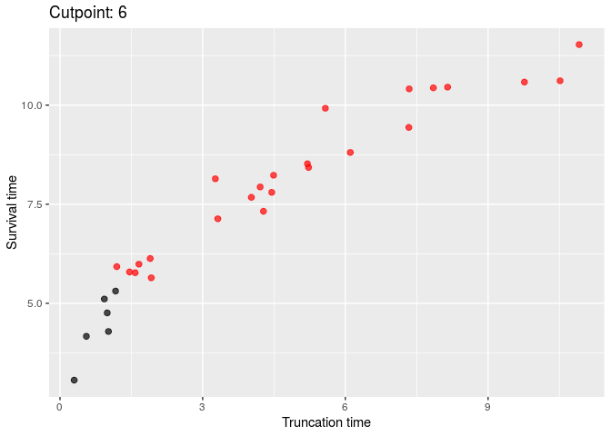
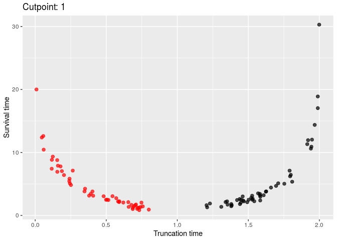
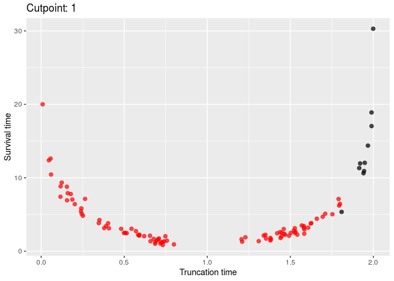

```{r default, include = FALSE}
knitr::opts_chunk$set(prompt = TRUE, comment = "", collapse = TRUE)
library(permDep)
```

## Objective

In this vignette, we demonstrate the usage of the `permDep` function.

## Generating truncated data

We define the following functions to generate survival data with dependent left-truncation. 

In the first setting, we generate the survival time from a Weibull distribution with
shape parameter 3 and scale parameter 8.5
and generate the truncation time from an exponential with mean 5.
The dependence between the survival time and the truncation time is controlled by a normal 
copula from the `copula` package with a pre-specified pre-truncation unconditional Kendall's tau (`tau`).


```{R sim1}
library(copula)
simDat1 <- function(n, tau) {
    k <- 1
    tt <- xx <- rep(-1, n)
    kt <- iTau(normalCopula(), tau)
    cp <- normalCopula(kt, dim = 2)
    dist <- mvdc(cp, c("exp", "weibull"), list(list(rate = 0.2), list(shape = 3, scale = 8.5)))  
    while(k <= n){
        dat <- rMvdc(1, dist)
        tt[k] <- dat[1]
        xx[k] <- dat[2]
        if(tt[k] <= xx[k]) k = k + 1
    } 	
    data.frame(Trun = tt, Time = xx)
}
```

The `simDat1` function generates monotone dependence model and is used in @chiou2018permutation in the absence of censoring. 
The following scatterplots confirms the monotonic dependence.
```{R sim1-plot}
library(ggplot2)
library(gridExtra)
set.seed(123)
tmp <- lapply(-4:4/5, function(x) 
  qplot(Trun, Time, data = simDat1(100, x), main = paste("Tau = ", x)))
do.call("grid.arrange", c(tmp, ncol = 3))
```


In the second setting, we consider a scenario with non-monotonic dependence between the survival 
time and the truncation time. 
We used a normal copula to specify the joint distribution of $(X, |T- 0.5|)$, 
where $X$ is the survival time and $T$ is the truncation time. 
We generate $X$ from a Weibull distribution with shape parameter 1 and scale parameter 4, 
and generate $T$ from a uniform distribution between 0 and 1. 
This implies that the pre-truncation unconditional Kendall's taus have different signs for 
$T < 0.5$ and $T\ge0.5$. 

```{R sim2}
simDat2 <- function(n, tau) {
    k <- 1
    tt <- xx <- rep(-1, n)
    kt <- iTau(normalCopula(), tau)
    cp <- normalCopula(kt, dim = 2)
    dist <- mvdc(cp, c("unif", "weibull"),
                 list(list(min = 0, max = 1), list(shape = 1, scale = 4)))
    while(k <= n){
        tmp <- rMvdc(1, dist)
        if (k <= n/2) tt[k] <- tmp[1]
        if (k > n/2) tt[k] <- 2 - tmp[1]
        xx[k] <- tmp[2]
        if(tt[k] <= xx[k]) k = k + 1
    }
    dat <- data.frame(Trun = tt, Time = xx)
    dat
}
```

```{R sim2-plot}
set.seed(123)
tmp <- lapply(-4:4/5, function(x) 
  qplot(Trun, Time, data = simDat2(100, x), main = paste("Tau = ", x)))
do.call("grid.arrange", c(tmp, ncol = 3))
```

## The `permDep` function

The arguments of `permDep` are as follow
```{R permDep-args}
args(permDep)
```
The arguments are 

* `trun` is the left truncation time
* `obs` is the observed failure time; this is defined to be the minimum of the survival time and censoring time
In addition, this is required to be greater than the truncation time
* `permSize` is the number of permutations
* `cens` is the status indicator; 0 = censored, 1 = event
* `sampling` is a character string specifying the sampling method  used in permutation. 
  The following are permitted. 
  * `conditional` conditional permutation
  * `unconditional` unconditional permutation
  * `is.conditional` importance sampling version of the conditional permutation (under development)
  * `is.unconditional` importance sampling version of the unconditional permutation (under development)
* `kendallOnly` is a logical value indicating whether to use the conditional Kendall's tau as the only test statistics
* `minp1Only` is a logical value indicating whether to use the minp1 test as the only test statistics
* `minp2Only` is a logical value indicating whether to use the minp2 test as the only test statistics
  * The default is to use all three test statistics (conditional Kendall's tau, minp1, and minp2) 
* `nc` is the number of cores used in the permutation test. When `nc > 1`, permutation is carried out with parallel computing methods.
The default is to use half of the available number of CPU cores on the current host.
* `seed` is an optional vector containing random seeds to be used to generate permutation samples. Random seeds will be used when left unspecified.
* `minp.eps` is an optional value indicating the width of the intervals used in minp2 procedure. The following are permitted.
  * *a single numerical number* sets the common width for all intervals
  * *a numerical vector* uses user specified width for the intervals. The length of the vector needs to be a sub-multiple or multiple of the number of uncensored events. 
  * *a character string* uses the pre-implemented algorithm to calculate the width of the intervals. This option can be either "in" or "out", which require the minimum number of uncensored events inside or outside of each interval, respectively.
  * `NULL` uses the automatic selection algorithm outlined in @chiou2018permutation
* `plot.int` is a logical value indicating whether to plot the intervals when applying the minp tests. 
This is more useful when only one of `minp1Only` and `minp2Only` is `TRUE`.

We will illustrate the usage of `permDep` with simulated data generated from `simDat1` and `simDat2`.

## Permutation test
We first use a small sample size example to demonstrate the different features. 
```{R, cache = TRUE}
set.seed(123)
dat <- simDat1(30, .9) ## highly correlated data
```

### With or without parallel computing
Note that the computation time depends on the machine setting in the current host. 
```{R nc, cache = TRUE}
parallel::detectCores()
set.seed(123);system.time(f1 <- permDep(dat$Trun, dat$Time, 500, nc = 1))
set.seed(123);system.time(f2 <- permDep(dat$Trun, dat$Time, 500, nc = parallel::detectCores()))
identical(f1, f2)
f1
```
Computation time is faster with parallel computation, e.g., `f2`, 
but using `r parallel::detectCores()` does not make the program run `r parallel::detectCores()` faster.

### Different `minp.eps` options
```{R minp, cache = TRUE}
permDep(dat$Trun, dat$Time, 500, minp2Only = TRUE)$p.valueMinp2
permDep(dat$Trun, dat$Time, 500, minp2Only = TRUE, minp.eps = 0.5)$p.valueMinp2
permDep(dat$Trun, dat$Time, 500, minp2Only = TRUE, minp.eps = "in")$p.valueMinp2
permDep(dat$Trun, dat$Time, 500, minp2Only = TRUE, minp.eps = "out")$p.valueMinp2
```
The performance of the minp2 test depends on the specification of the interval width (e.g., `minp.esp`), 
however, the resulting $p$-values from the above example are significant at $\alpha = 0.05$.

## Track intervals from minp tests

**To render the animation in this section, the users might need to install the [`gifski`](https://cran.r-project.org/web/packages/gifski/index.html) package.**

Enabling `plot.int` allows users to visualize the intervals used in computing the log-rank statistics 
when applying the minp1 and the minp2 tests on the observed data.
```{R minp1, cache = TRUE}
permDep(dat$Trun, dat$Time, 500, minp1Only = TRUE, 
        plot.int = TRUE, anim_name = "vig-minp1")
```




```{R minp2, cache = TRUE}
permDep(dat$Trun, dat$Time, 500, minp2Only = TRUE, 
        plot.int = TRUE, anim_name = "vig-minp2")
```


We use `simDat2` to generate truncated data with non-monotone dependence. 
This scenario would emphasize the usefulness of the minp2 test. 
```{R, cache = TRUE}
set.seed(123)
dat <- simDat2(100, -.9) ## highly correlated data
```


```{R minp1-non-monotone, cache = TRUE}
permDep(dat$Trun, dat$Time, 500, minp1Only = TRUE, 
        plot.int = TRUE, anim_name = "vig-minp1-non-monotone")
```


```{R minp2-non-monotone1, cache = TRUE}
permDep(dat$Trun, dat$Time, 500, minp2Only = TRUE, 
        plot.int = TRUE, anim_name = "vig-minp2-non-monotone")
```



```{R minp2-non-monotone2, cache = TRUE}
permDep(dat$Trun, dat$Time, 500, minp2Only = TRUE, minp.eps = "out",
        plot.int = TRUE, anim_name = "vig-minp2-2")
```



## Reference

